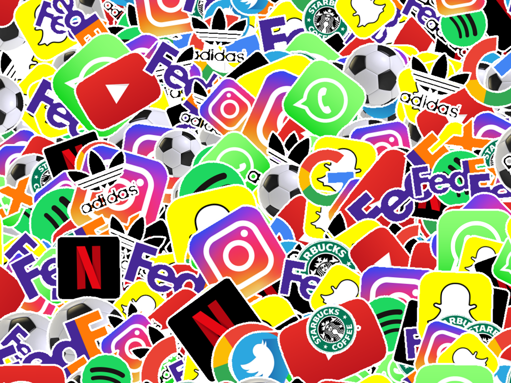

# Sticker Bomb

Creates a sticker bomb effect by overlaying multiple images.



## Usage

You will need a number of images in PNG format. For best results, use images with transparent backgrounds. The more images you have, the better the effect will be.

Images are selected at random and overlaid on top of each other to create a sticker bomb effect. A white border is added around each image to enhance the sticker appearance so you don't need to add borders to your images.

We are using the native .NET Graphics library for image manipulation which can be a little slow. For best performance, use images that are not too large in dimensions.

You can use the Windows Desktop app to produce an image or use the `EoS.StickerBomb` assembly in your own project.

All code is free to use and modify as you see fit. This is just bit of fun.

```
        private void ExampleUsage()
        {
            using var generator = new EoS.StickerBomb.Generator();
            
            //Create canvass of 2000x2000 pixels
            generator.Initialize(2000, 2000);

            //Get sticker fil from Stickers folder
            var stickerFiles = Directory.GetFiles(Path.Combine(AppDomain.CurrentDomain.BaseDirectory, "Stickers"), "*.png");

            //Load stickers into memory
            generator.LoadStickers(stickerFiles);

            //Apply stickers to canvass
            generator.ApplyStickers(progressBitmap =>
            {
                //Display progress or do something else
            });

            //Get final image
            var bitMap = generator.GetCanvass();

            //Save to file
            bitMap.Save("sticker_bomb.png", System.Drawing.Imaging.ImageFormat.Png);
        }
```

## Concept

The concept is based on the idea of a "sticker bomb," where multiple stickers are layered on top of each other to create a visually appealing collage. The application randomly selects images from a provided set and places them on a canvas, applying random rotations and positions to create a dynamic effect.

To ensure good coverage, we create a grid on the canvass. For each grid cell we get a sample of the transparent pixels. (Not all of them but enough to get an approximation of the available space). We then randomly select a sticker and try to place it in one of the available transparent pixels.

We repeat this until we have place the max number of stickers on the cell (as specified) or we run out of transparent pixels.

The selection of transparent pixels is randomised.

## ToDo

- Add more options for sticker placement and rotation
- Improve performance for large images
- Add option to save in different formats
- Create a web version of the app
- Add more image effects
- Possibly add multi threading for performance using a different image library

## License
This project is licensed under the MIT License - see the [LICENSE](LICENSE) file for details.

Use as seen. No warranties or guarantees. Enjoy!


